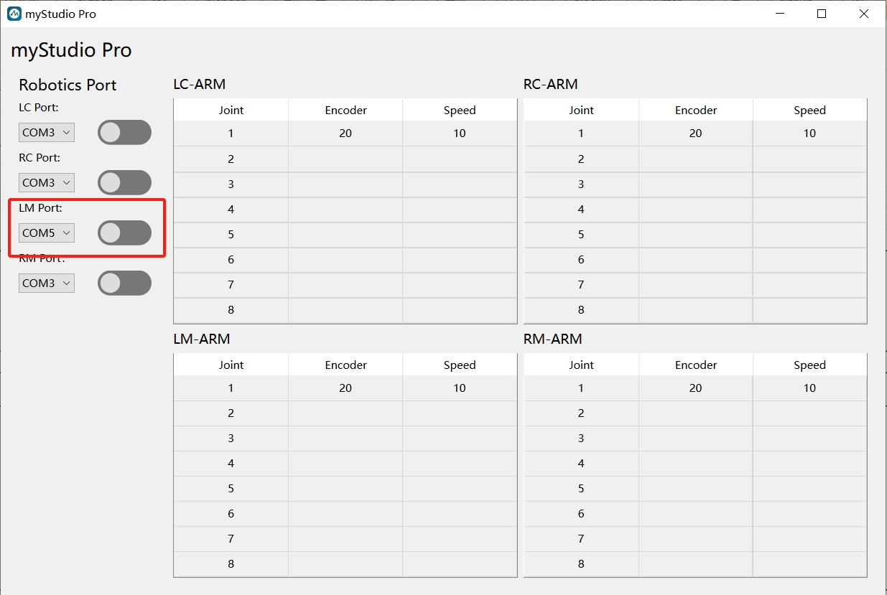
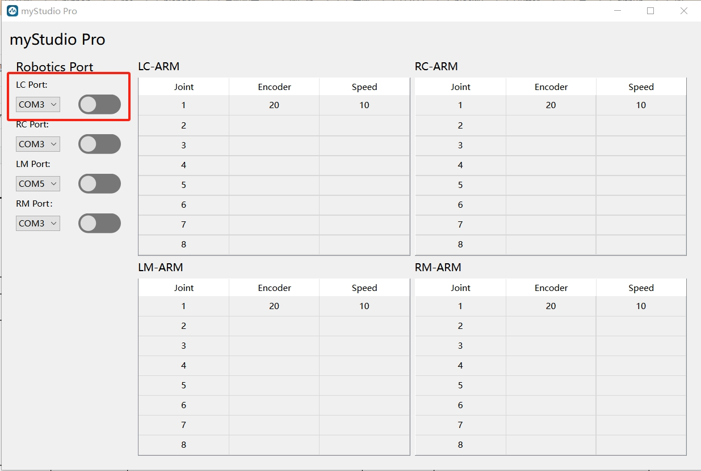

# myArm M&C 控制案例

[English](./README.md)

## 安装依赖

```shell
pip install -r requirement.txt
```

## 运行程序

```shell
python main.py
```

## 程序使用说明

串口的打开有顺序要求：先开启myArmM的串口连接，再开启myArmC的串口连接。




两个串口都开启以后就可以通过移动myArmC来控制myArmM运动。
