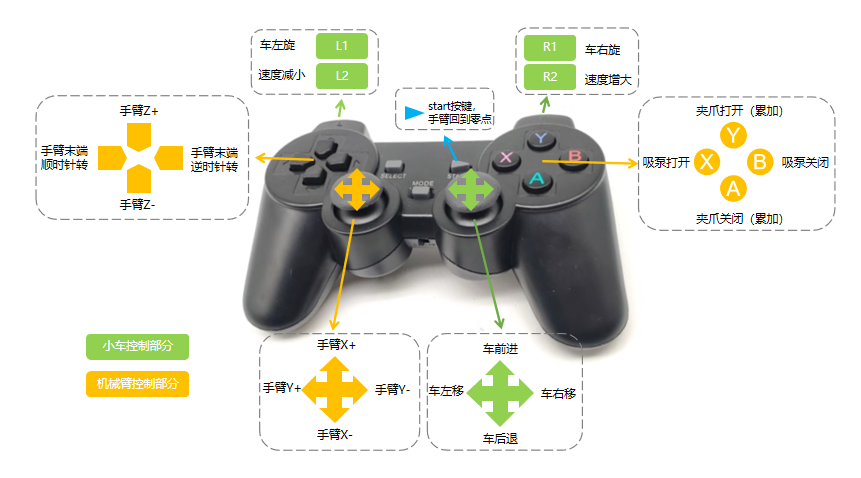

# myAGVPro Composite Kit Handle Control Case

- [简体中文](./README_zh.md)
- [English](./README.md)

## Program description

**The handle function of the myAGVPro composite kit is shown below:**


**Note:**

1. Before starting the program, you need to connect the handle to myAGVPro and turn on the handle.
2. The `myArmM750` robot arm does not support suction pumps, and the program will prompt when using it

**Kit Usage**

For the use of composite kits, please visit the following link：

- myAGVPro+MyArmM750: [Home storage training](https://docs.elephantrobotics.com/docs/myAGV_Pro_en/7-ExamplesRobotsUsing/7.1-MyArmM750.html)
- myAGVPro+MyCobot320: [Warehouse cargo handling](https://docs.elephantrobotics.com/docs/myAGV_Pro_en/7-ExamplesRobotsUsing/7.2-MyCobot320.html)
- myAGVPro+MyCobotPro630: [MCU door opening training](https://docs.elephantrobotics.com/docs/myAGV_Pro_en/7-ExamplesRobotsUsing/7.3-MyCobotPro630.html)

## Run the program

1. Clone the repository to the myAGVPro system
    ```shell
    git clone https://github.com/elephantrobotics/pymycobot.git
    ```
2. Enter the repository directory
    ```shell
    cd pymycobot/demo/myAGVPro_Composite_Kit
    ```
3. Install dependencies
    ```shell
    pip install -r requirement.txt
    ```
4. Select the robot model

   To select the robot model, you need to configure the values ​​of `COMPOSITE_KIT_TYPE` and `COMPOSITE_KIT_COMPORT`.
   `COMPOSITE_KIT_TYPE`
   indicates the currently selected robot. The modified value needs to match the actual robot model, otherwise the robot
   cannot be controlled normally. The current optional robot arm parameters and models are as follows:

   | Parameters      | Robot arm model |
      |-----------------|-----------------|
   | `MyCobotPro630` | MyCobot Pro630  |
   | `MyCobot320`    | MyCobot320 M5   |
   | `MyArmM750`     | MyArm M750      |
   | `Undefined`     | /               |

   When `COMPOSITE_KIT_TYPE = Undefined`, it means that the robot arm is not used. At this time, the handle cannot
   control the robot arm and is only valid for MyAGVPro.

   `COMPOSITE_KIT_COMPORT` represents the serial port number of the robot arm. The serial port number needs to be
   modified according to the actual connected robot arm. Configuration is required when the selected robot arm
   is `myArmM750` or `MyCobot320`.

   When the selected robot arm is `MyCobotPro630`, no configuration is required, because the control of `MyCobot Pro630`
   uses TCP protocol instead of serial port protocol. The values ​​of `COMPOSITE_KIT_HOST` and `COMPOSITE_KIT_PORT` need
   to be configured.

   `COMPOSITE_KIT_HOST` indicates the IP address of the robot, and `COMPOSITE_KIT_PORT` indicates the port number of the
   robot. The default value is `5001`, which needs to be modified according to the actual connected robot.
   The IP address and port number of the robot can be viewed through the built-in software `roboflow`. Note that the
   robot should be in the same LAN as MyAGVPro at this time.

5. Run the program

```shell
python main.py
```
