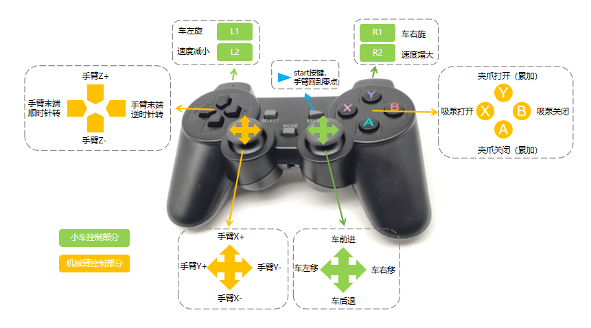

# myAGVPro复合套件手柄控制案例

- [简体中文](./README_zh.md)
- [English](./README.md)

## 程序说明

**myAGVPro复合套件的手柄功能如下图所示:**


**注意:**

1. 在启动程序之前，您需要将手柄连接到 myAGVPro 并打开手柄。
2. `myArmM750`机械臂不支持吸泵，使用时程序会提示

**套件使用:**
复合套件使用请访问以下链接

- myAGVPro+MyArmM750 [家居收纳训练](https://docs.elephantrobotics.com/docs/myAGV_Pro_cn/7-ExamplesRobotsUsing/7.1-MyArmM750.html)
- myAGVPro+MyCobot320 [仓储货物搬运](https://docs.elephantrobotics.com/docs/myAGV_Pro_cn/7-ExamplesRobotsUsing/7.2-MyCobot320.html)
- myAGVPro+MyCobotPro630 [MCU开门训练](https://docs.elephantrobotics.com/docs/myAGV_Pro_cn/7-ExamplesRobotsUsing/7.3-MyCobotPro630.html)

## 程序运行

1. 克隆仓库到本地
    ```shell
    git clone https://github.com/elephantrobotics/pymycobot.git
    ```
2. 进入仓库目录
    ```shell
    cd pymycobot/demo/myAGVPro_Composite_Kit
    ```
3. 安装依赖
    ```shell
    pip install -r requirement.txt
    ```
4. 选择机械臂型号

   选择机械臂型号, 需要配置`COMPOSITE_KIT_TYPE`和`COMPOSITE_KIT_COMPORT`的值。
   `COMPOSITE_KIT_TYPE`
   表示当前选择的机械臂，修改的值需要与实际上的机械臂型号匹配，否则无法正常控制机械臂。当前可选机械臂参数及型号如下所示:

   | 参数              | 机械臂型号          |
      |-----------------|----------------|
   | `MyCobotPro630` | MyCobot Pro630 |
   | `MyCobot320`    | MyCobot320 M5  |
   | `MyArmM750`     | MyArm M750     |
   | `Undefined`     | /              |

   当`COMPOSITE_KIT_TYPE = Undefined`时，表示不使用机械臂，此时手柄无法对机械臂进行控制，只对MyAGVPro有效。
   `COMPOSITE_KIT_COMPORT`代表机械臂的串口号，需要根据实际连接的机械臂修改串口号。 选择的机械臂为`myArmM750`或`MyCobot320`
   时需要配置。
   当选择的机械臂为`MyCobotPro630`时不需要配置, 因为控制`MyCobot Pro630`
   使用的是TCP协议，而不是串口协议。需要配置`COMPOSITE_KIT_HOST`和`COMPOSITE_KIT_PORT`的值。
   `COMPOSITE_KIT_HOST`表示机械臂的IP地址，`COMPOSITE_KIT_PORT`表示机械臂的端口号，默认为`5001`, 需要根据实际连接的机械臂进行修改。
   可以通过内置软件`roboflow`查看机械臂的IP地址和端口号。注意，此时机械臂应该和MyAGVPro在同一个局域网内。

5. 运行程序
   ```shell
   python main.py
   ```

